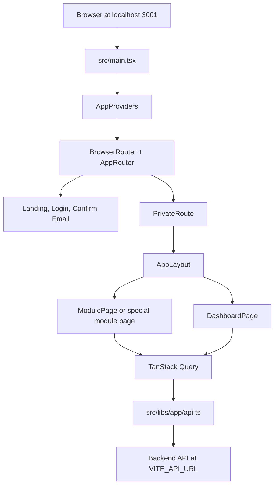

# Frontend And Backend Working Guide

This project is a healthcare management dashboard named MedSphere. The frontend is a React single page app. The backend is expected to expose the authentication and Hospital Management System APIs consumed by the frontend.

The goal of this document is to make the project clear for both frontend and backend developers: how the app starts, how routes work, how authentication works, which roles can do what, which endpoints are expected, and where to change things.

## Quick Links

- App entry: [`src/main.tsx`](../src/main.tsx)
- Router: [`src/app/router.tsx`](../src/app/router.tsx)
- Providers: [`src/app/providers/AppProviders.tsx`](../src/app/providers/AppProviders.tsx)
- Auth context: [`src/app/contexts/AuthContext.tsx`](../src/app/contexts/AuthContext.tsx)
- Current API client: [`src/libs/app/api.ts`](../src/libs/app/api.ts)
- Legacy/parallel API client: [`src/libs/axios/client.ts`](../src/libs/axios/client.ts)
- Module config: [`src/config/modules.tsx`](../src/config/modules.tsx)
- Route metadata: [`src/config/moduleMeta.ts`](../src/config/moduleMeta.ts)
- Permissions: [`src/config/permissions.ts`](../src/config/permissions.ts)
- Generic module page: [`src/pages/app/ModulePage.tsx`](../src/pages/app/ModulePage.tsx)
- App layout/sidebar: [`src/ui/organisms/AppLayout.tsx`](../src/ui/organisms/AppLayout.tsx)
- Environment config: [`src/config/env.ts`](../src/config/env.ts)
- Vite config: [`vite.config.ts`](../vite.config.ts)
- Package scripts and dependencies: [`package.json`](../package.json)
- Detailed frontend prompt/spec: [`docs/frontend-detailed-prompt.md`](./frontend-detailed-prompt.md)

## Tech Stack

- React 19 with TypeScript.
- Vite for local development and production builds.
- React Router for client-side routing.
- TanStack Query for server-state fetching, caching, mutations, and invalidation.
- Axios for HTTP requests.
- Redux Toolkit for compatibility state used by auth, transactions, and auth chat slices.
- Zod for form validation schemas.
- i18next/react-i18next for English and German localization.
- Tailwind CSS for styling.
- Vitest and Testing Library for tests.

Useful external docs:

- [React docs](https://react.dev/)
- [Vite guide](https://vite.dev/guide/)
- [React Router docs](https://reactrouter.com/)
- [TanStack Query docs](https://tanstack.com/query/latest)
- [Axios docs](https://axios-http.com/docs/intro)
- [Redux Toolkit docs](https://redux-toolkit.js.org/)
- [Zod docs](https://zod.dev/)
- [i18next docs](https://www.i18next.com/overview/getting-started)
- [Tailwind CSS docs](https://tailwindcss.com/docs)
- [React Hook Form docs](https://www.react-hook-form.com/)
- [Vitest docs](https://vitest.dev/guide/)

## How To Run

Install dependencies:

```bash
npm install
```

Create a local environment file:

```bash
cp .env.example .env
```

Start frontend dev server:

```bash
npm run dev
```

The Vite dev server is configured for:

```text
http://localhost:3001
```

Build production assets:

```bash
npm run build
```

Run tests:

```bash
npm test
```

Run lint:

```bash
npm run lint
```

## Environment Variables

Environment variables are read in [`src/config/env.ts`](../src/config/env.ts).

| Variable | Default | Purpose |
| --- | --- | --- |
| `VITE_API_CORE` | `http://localhost:3011` | Main backend base URL. |
| `VITE_API_URL` | falls back to `VITE_API_CORE` | HMS API base URL used by the current app API client. |
| `VITE_API_DEVICE_INFO` | falls back to `VITE_API_CORE` | Secondary API base used by the legacy Axios client. |

The frontend sends requests with `withCredentials: true`, so the backend must support cookies and CORS credentials for local development.

## High-Level Flow



## Frontend Structure

| Folder/File | Role |
| --- | --- |
| `src/main.tsx` | Imports global CSS and i18n, applies theme, mounts React, wraps app providers. |
| `src/App.tsx` | Adds `BrowserRouter` and renders `AppRouter`. |
| `src/app/router.tsx` | Defines public routes, private routes, lazy-loaded route pages, and module routes. |
| `src/app/providers/AppProviders.tsx` | Adds Redux, language, TanStack Query, toast, and auth providers. |
| `src/app/contexts` | Runtime contexts: auth, language, and toast notifications. |
| `src/config/modules.tsx` | Central module definitions: endpoint, fields, filters, columns, validation, payload cleanup. |
| `src/config/permissions.ts` | Role-based permission matrix and helper functions. |
| `src/pages/app` | Current route pages and generic module page. |
| `src/pages/Dashboard` | Older/specialized dashboard pages. Medical records and prescriptions still use pages here. |
| `src/ui/atoms` | Small reusable UI controls such as buttons, inputs, badges, cards. |
| `src/ui/molecules` | Medium reusable UI blocks such as page header, empty state, skeletons, pagination. |
| `src/ui/organisms` | Large reusable UI blocks such as layout, tables, modals, auth card. |
| `src/libs/app` | Current API helper and data normalization utilities. |
| `src/libs/axios` | Legacy/parallel API helper used by older domain modules. |
| `src/domain` | Older domain-specific APIs, hooks, types, utilities, and Redux slices. |
| `src/locales` | English and German translation JSON files. |
| `tests` and `*.test.tsx` | Vitest and Testing Library tests. |

## Application Startup

1. `src/main.tsx` loads CSS and i18n, applies the saved or default theme, and renders React.
2. `AppProviders` wraps the app with:
   - Redux store.
   - Language provider.
   - TanStack Query client.
   - Toast provider.
   - Auth provider.
3. `App.tsx` creates the browser router.
4. `AppRouter` decides whether to show public pages, protected pages, or a not-found page.
5. Protected pages render inside `AppLayout`, which builds the sidebar based on the logged-in user's permissions.

## Routes

Routes are defined in [`src/app/router.tsx`](../src/app/router.tsx).

| URL | Page | Access |
| --- | --- | --- |
| `/` | Landing page | Guest only. Authenticated users redirect to `/dashboard`. |
| `/login` | Login page | Guest only. Authenticated users redirect to `/dashboard`. |
| `/confirm-email` | Confirm email page | Public. |
| `/dashboard` | Dashboard overview | Private, requires dashboard `VIEW`. |
| `/patients` | Patients module | Private, requires patients `VIEW`. |
| `/doctors` | Doctors module | Private, requires doctors `VIEW`. |
| `/departments` | Departments module | Private, requires departments `VIEW`. |
| `/appointments` | Appointments module | Private, requires appointments `VIEW`. |
| `/medical-records` | Medical records list | Private, requires medical records `VIEW`. |
| `/medical-records/new` | Medical record form | Private, nested medical records route. |
| `/medical-records/:id/edit` | Medical record edit form | Private, nested medical records route. |
| `/prescriptions` | Prescriptions page | Private, requires prescriptions `READ`. |
| `/rooms` | Rooms module | Private, requires rooms `VIEW`. |
| `/admissions` | Admissions module | Private, requires admissions `VIEW`. |
| `/invoices` | Invoices module | Private, requires invoices `VIEW`. |
| `/nurses` | Nurses module | Private, requires nurses `VIEW`. |
| `/receptionists` | Receptionists module | Private, requires receptionists `VIEW`. |
| `/unauthorized` | Access denied | Private. |
| `*` | Not found | Fallback route. |

Most module routes are created by [`src/pages/app/routes/createModuleRoutePage.tsx`](../src/pages/app/routes/createModuleRoutePage.tsx). Those routes render the generic [`ModulePage`](../src/pages/app/ModulePage.tsx). Medical records and prescriptions use specialized pages from `src/pages/Dashboard`.

## Authentication Flow

Current auth lives in [`src/app/contexts/AuthContext.tsx`](../src/app/contexts/AuthContext.tsx) and uses [`authApi`](../src/libs/app/api.ts).

Startup flow:

1. `AuthProvider` runs `authApi.refresh()` when the app loads.
2. If refresh succeeds, it receives an access token and sometimes a user.
3. If the user is missing, the frontend calls `authApi.me(accessToken)`.
4. The access token is stored in React state, not local storage.
5. User data and token are also mirrored into Redux for older code paths.
6. If refresh fails, auth state is cleared and the user remains logged out.

Login flow:

1. Login page sends `{ identifier, password }`.
2. Backend returns `{ accessToken, user? }`.
3. If `user` is missing, frontend calls `/api/auth/me`.
4. User is redirected to the original protected page or `/dashboard`.

Request refresh flow:

1. `apiClient` attaches `Authorization: Bearer <accessToken>` to requests.
2. If a request receives `401`, the client calls `/api/auth/refresh`.
3. While refresh is running, other failed requests wait for the same refresh promise.
4. If refresh succeeds, the original request is retried with the new token.
5. If refresh fails, auth state is cleared and the browser is sent to `/login`.

Logout flow:

1. Frontend calls `/api/auth/logout` or `/api/auth/logout-all`.
2. Local auth state is cleared even if the server call fails.

Backend requirements for auth:

- Refresh token should be stored as an HTTP-only cookie.
- Access token is returned in the JSON response.
- CORS must allow credentials.
- Login should accept an `identifier` field. This may be email or username depending on backend implementation.
- Auth responses should include `accessToken`; including `user` is recommended to avoid an extra `/me` call.

## Current Auth Endpoints

The current app API client uses `/api/auth` paths from [`src/libs/app/api.ts`](../src/libs/app/api.ts).

| Method | Endpoint | Purpose |
| --- | --- | --- |
| `POST` | `/api/auth/login` | Login with `{ identifier, password }`. |
| `POST` | `/api/auth/refresh` | Refresh access token using cookie refresh token. |
| `POST` | `/api/auth/logout` | Logout current session. |
| `POST` | `/api/auth/logout-all` | Logout all sessions. |
| `GET` | `/api/auth/me` | Load current authenticated user. |
| `POST` | `/api/auth/change-password` | Change the logged-in user's password. |
| `POST` | `/api/auth/confirm-email` | Confirm email with `{ token }`. |
| `POST` | `/api/auth/resend-confirmation-email` | Resend confirmation email. |
| `PATCH` | `/api/auth/users/:userId/password` | Admin password reset for a user. |

There is also an older domain auth API in [`src/domain/auth/auth.api.ts`](../src/domain/auth/auth.api.ts) that uses `/auth` without `/api`. Keep this in mind if older pages are reused.

## Roles And Permissions

Roles are defined in [`src/config/permissions.ts`](../src/config/permissions.ts):

- `ADMIN`
- `DOCTOR`
- `NURSE`
- `RECEPTIONIST`

Permission actions:

- `VIEW`: can see the module route in navigation and open the page.
- `READ`: can fetch/read module data.
- `CREATE`: can create records.
- `UPDATE`: can edit records.
- `DELETE`: can delete records.
- `ACTION`: can run special module actions such as discharge, pay, status changes, or workflow actions.

The frontend normalizes roles to uppercase. Backend may return roles as strings or arrays, but the final normalized values must match the role names above.

### Role Matrix

| Module | Admin | Doctor | Nurse | Receptionist |
| --- | --- | --- | --- | --- |
| Dashboard | View/read | View/read | View/read | View/read |
| Patients | Full CRUD | View/read | View/read | View/read/create/update |
| Appointments | Full CRUD + action | View/read/update/action | View/read | View/read/create/update/action |
| Medical records | Full CRUD | View/read/create/update | View/read | No access |
| Prescriptions | Full CRUD | View/read/create/update | Read only | No access |
| Rooms | Full CRUD + action | Read only | View/read | View/read |
| Admissions | Full CRUD + action | Read only | View/read | View/read/create/update/action |
| Invoices | Full CRUD + action | No access | No access | View/read/create/update/action |
| Departments | Full CRUD | No access | No access | No access |
| Doctors | Full CRUD | No access | No access | No access |
| Nurses | Full CRUD | No access | No access | No access |
| Receptionists | View/read/create/update | No access | No access | No access |
| Users | Full CRUD | No access | No access | No access |

Important frontend behavior:

- Navigation only shows modules where the user has `VIEW`.
- Lists only fetch if the user has `READ`.
- Create/edit/delete buttons depend on module permission flags.
- `ADMIN` effectively has all configured access.
- If a route is blocked, the user is redirected to `/unauthorized` or `/login`.
- The active permission truth for current routes is `src/config/permissions.ts`. Some `permissions` fields inside `moduleConfigs` are older descriptive config and are not the main gate used by `ModulePage`.

## Main Module System

Most CRUD pages are generated from [`moduleConfigs`](../src/config/modules.tsx). Each module config defines:

- Route path.
- Backend endpoint.
- CRUD service.
- Sort options.
- Default sort.
- Filters.
- Form fields.
- Table columns.
- Zod schema.
- Payload cleanup.
- Item title.
- Create/edit/delete behavior.

The generic [`ModulePage`](../src/pages/app/ModulePage.tsx) reads the config and handles:

- URL query parameters for page, limit, sort, order, and filters.
- List query via TanStack Query.
- Detail query when opening edit/detail modals.
- Reference dropdown queries, such as doctors, patients, departments, rooms.
- Create and update mutations.
- Delete mutation.
- Password reset mutation for user-linked staff modules.
- Toast success/error messages.
- Pagination.
- Empty/loading/error states.

## Module API Table

These are the main module endpoints expected by the current config.

| Module | Route | Endpoint | Filters | Create/Edit Fields | Main Roles |
| --- | --- | --- | --- | --- | --- |
| Patients | `/patients` | `/api/patients` | `search`, `bloodGroup`, `gender` | `firstName`, `lastName`, `dateOfBirth`, `gender`, `phoneNumber`, `bloodType`, `address` | Admin full; receptionist create/update; doctor/nurse read |
| Doctors | `/doctors` | `/api/doctors` | `departmentId`, `specialization` | account mode, `userId`, `firstName`, `lastName`, `specialization`, `departmentId`, `phoneNumber`, optional new login fields | Admin full |
| Departments | `/departments` | `/api/departments` | none | `name`, `location`, `description` | Admin full |
| Appointments | `/appointments` | `/api/appointments` | `date`, `doctorId`, `patientId`, `status`, `from`, `to` | `patientId`, `doctorId`, `date`, `time`, edit-only `status`, `notes` | Admin/receptionist full; doctor update/action; nurse read |
| Medical records | `/medical-records` | `/api/medical-records` | `patientId` | `patientId`, `doctorId`, `date`, `diagnosis`, `treatment`, `prescriptionsText` | Admin full; doctor view/read/create/update; nurse read |
| Prescriptions | `/prescriptions` | `/api/prescriptions` | `medicalRecordId` | `medicalRecordId`, `medicine`, `dosage`, `duration`, `instructions` | Admin/doctor create/update; nurse read |
| Rooms | `/rooms` | `/api/rooms` | `departmentId`, `type` | `roomNumber`, `departmentId`, `type`, `status`, `capacity` | Admin full; nurse/receptionist read; doctor read |
| Admissions | `/admissions` | `/api/admissions` | `status`, `patientId`, `roomId` | `patientId`, `roomId`, `admissionDate` | Admin/receptionist/nurse create/update/action; doctor read |
| Invoices | `/invoices` | `/api/invoices` | `patientId`, `status` | `patientId`, `amount`, `date`, edit-only `status`, `description` | Admin/receptionist create/update/action |
| Nurses | `/nurses` | `/api/nurses` | `departmentId` | account mode, `userId`, `firstName`, `lastName`, `departmentId`, `shift`, optional new login fields | Admin full |
| Receptionists | `/receptionists` | `/api/auth/users` and `/api/auth/users/receptionists` | client-side `search`, `isActive`, `emailConfirmed` | `firstName`, `lastName`, `email`, `username`, create-only `password`, `phoneNumber`, `isActive`, `emailConfirmed`, `lockoutEnabled` | Admin create/update/read |

Notes:

- `createCrudService` sends list requests with only the allowed params configured per module.
- `sortBy` values are converted from camelCase to snake_case before sending to the backend.
- Empty values are stripped before create/update payloads.
- Appointments and invoices omit `status` on create because defaults are configured on the frontend and should usually be enforced by the backend too.
- Admissions have create enabled, but generic edit/delete UI is disabled in `actions`; discharge-type flows should be represented as actions.
- Receptionists are special: list filtering/pagination is done client-side after fetching `/api/auth/users` and filtering users with role `RECEPTIONIST`.

## Reference Dropdown Endpoints

Reference dropdowns are configured in [`referenceConfigs`](../src/config/modules.tsx).

| Reference | Endpoint | Purpose |
| --- | --- | --- |
| Patients | `/api/patients?page=1&limit=100&sortBy=created_at&order=DESC` | Patient selects. |
| Departments | `/api/departments/all?sortBy=name&order=ASC` | Department selects. |
| Users | `/api/auth/users` | Link doctor/nurse to an existing user account. |
| Doctors | `/api/doctors?page=1&limit=100&sortBy=last_name&order=ASC` | Doctor selects. |
| Rooms | `/api/rooms/available?page=1&limit=100&sortBy=room_number&order=ASC` | Available room selects, with `/api/rooms` fallback. |
| Medical records | `/api/medical-records?page=1&limit=100&sortBy=date&order=DESC` | Prescription medical-record selects. |
| Admissions | `/api/admissions?page=1&limit=100&sortBy=admission_date&order=DESC` | Admission references. |

Backend should return either a plain array or an object with `data` or `items`.

## Dashboard Endpoints

Dashboard requests use fallback paths from [`src/pages/app/DashboardPage.tsx`](../src/pages/app/DashboardPage.tsx).

| Widget | Primary Endpoint | Fallback Endpoint |
| --- | --- | --- |
| Today's appointments | `/api/dashboard/appointments/today` | `/api/appointments/today` |
| Available rooms | `/api/dashboard/rooms/available` | `/api/rooms/available` |
| Active admissions | `/api/dashboard/admissions/active` | `/api/admissions/active` |

Fallback only happens on `404`. Other errors are shown to the user.

## Expected Backend Response Shapes

For paginated module lists, the current frontend expects:

```json
{
  "data": [],
  "total": 0,
  "page": 1,
  "limit": 10,
  "totalPages": 1
}
```

The frontend also accepts `items` instead of `data` in many places:

```json
{
  "items": [],
  "total": 0,
  "page": 1,
  "limit": 10,
  "totalPages": 1
}
```

For reference endpoints, a plain array is also accepted:

```json
[
  { "id": "1", "firstName": "Ana", "lastName": "Krasniqi" }
]
```

For detail/create/update endpoints, return the created or updated entity:

```json
{
  "id": "1",
  "firstName": "Ana",
  "lastName": "Krasniqi"
}
```

For delete endpoints, `204 No Content` is fine.

For auth endpoints, preferred response:

```json
{
  "accessToken": "jwt-token",
  "user": {
    "id": "user-id",
    "firstName": "Ana",
    "lastName": "Krasniqi",
    "email": "ana@example.com",
    "roles": ["ADMIN"]
  }
}
```

The frontend converts snake_case response keys to camelCase in the current API client, so either `first_name` or `firstName` can work for many fields. Still, backend and frontend should agree on one style where possible.

## Backend Contract Details By Entity

Patients:

- Important fields: `id`, `userId`, `firstName`, `lastName`, `dateOfBirth`, `gender`, `phoneNumber`, `address`, `bloodType`.
- Filters: `search`, `bloodGroup`, `gender`.
- Patient `userId` is optional for portal login.

Doctors:

- Important fields: `id`, `userId`, `firstName`, `lastName`, `specialization`, `departmentId`, `phoneNumber`, `department`.
- Create can link an existing user with `userId` or create a new login with `email`, optional `username`, optional `password`.
- Phone number format is expected to look like `+38344111222`.

Departments:

- Important fields: `id`, `name`, `location`, `description`.
- `/api/departments/all` is used for dropdowns.

Appointments:

- Important fields: `id`, `patientId`, `doctorId`, `date` or `appointmentDate`, `time` or `appointmentTime`, `status`, `notes`, `patient`, `doctor`.
- Status values: `Scheduled`, `Completed`, `Cancelled`.
- README contract notes mention separate `appointmentDate` and `appointmentTime`; current generic module sends `date` and `time`, while renderers can read either naming style. Backend should either accept both or frontend should be aligned with the backend DTO.

Medical records:

- Important fields: `id`, `patientId`, `doctorId`, `date` or `recordDate`, `diagnosis`, `treatment`, `prescriptionsText`, `patient`, `doctor`.
- `prescriptionsText` is only a general summary. Medicine details belong in prescription rows.

Prescriptions:

- Important fields: `id`, `medicalRecordId`, `medicine`, `dosage`, `duration`, `instructions`.
- Linked to medical records.

Rooms:

- Important fields: `id`, `roomNumber`, `departmentId`, `type`, `status`, `capacity`, `department`.
- Type values: `GENERAL`, `ICU`, `SURGERY`, `EMERGENCY`, `PEDIATRIC`.
- Status values: `AVAILABLE`, `OCCUPIED`, `UNDER_MAINTENANCE`.

Admissions:

- Important fields: `id`, `patientId`, `roomId`, `admissionDate`, `dischargeDate`, `status`, `patient`, `room`.
- Status values: `ACTIVE`, `DISCHARGED`.
- Active admissions should be available from `/api/admissions/active` or dashboard endpoint.

Invoices:

- Important fields: `id`, `patientId`, `amount`, `date` or `invoiceDate`, `status`, `description`, `patient`.
- Status values: `PENDING`, `PAID`, `CANCELLED`.
- Invoices can optionally link to either an appointment or an admission according to the README contract notes.

Nurses:

- Important fields: `id`, `userId`, `firstName`, `lastName`, `departmentId`, `shift`, `department`.
- Shift values: `Morning`, `Evening`, `Night`.
- Create can link an existing user, create a new login, or create without portal account depending on backend support.

Receptionists:

- Important fields: `id`, `firstName`, `lastName`, `email`, `username`, `phoneNumber`, `isActive`, `emailConfirmed`, `lockoutEnabled`, `roles`, `createdAt`.
- Created through `/api/auth/users/receptionists`.
- Listed by fetching `/api/auth/users` and filtering `roles` for `RECEPTIONIST`.

## Error Handling Contract

Errors are normalized in [`getErrorMessage`](../src/libs/app/utils.ts).

Backend should prefer this error shape:

```json
{
  "message": "Human readable error message"
}
```

The message can also be an array:

```json
{
  "message": ["First name is required", "Email is invalid"]
}
```

Frontend maps common statuses:

- `400` or `422`: validation error.
- `401`: unauthorized.
- `403`: forbidden.
- `404`: not found.
- `409`: conflict.
- `429`: rate limit, with special login wording support.
- `500+`: server error.

## State Management

Server state:

- Main CRUD and dashboard data uses TanStack Query.
- Query keys are module-based, for example `[moduleKey, listParams]`.
- Mutations invalidate the module query key after successful create/update/delete.
- Reference data is cached with query keys like `['reference', key]`.

Client/UI state:

- Auth state is in `AuthContext`, with Redux mirroring for older code.
- Language state is in `LanguageContext` and persisted to local storage.
- Toast state is in `ToastContext`.
- Theme is managed through `src/config/theme.ts` and applied before render.
- Table filters, sorting, page, and limit are stored in URL search parameters.

Redux:

- Store is configured in [`src/app/store.ts`](../src/app/store.ts).
- Current reducers: `auth`, `transactions`, `authChat`.
- New module CRUD data should normally use TanStack Query, not Redux.

## Forms And Validation

Generic forms are rendered by [`EntityFormModal`](../src/ui/organisms/EntityFormModal.tsx) using field config from `moduleConfigs`.

Validation:

- Zod schemas live beside each module config in `src/config/modules.tsx`.
- Required text, positive number, email, username, and password rules are centralized near the top of that file.
- Doctor, nurse, and receptionist schemas are mode-aware because create and edit have different requirements.

Payload cleanup:

- `stripEmptyValues` removes empty values before sending.
- Module-specific `cleanPayload` functions handle account creation modes and create-only defaults.

## Localization

Language setup is in [`src/config/i18n.ts`](../src/config/i18n.ts).

Supported languages:

- English: `en`
- German: `de`

Translation files are in:

- `src/locales/en`
- `src/locales/de`

The current generic module config often uses `lt(en, de)` objects directly instead of string keys. Older/specialized pages use namespace JSON files.

## Styling And Layout

- Global styles are in [`src/index.css`](../src/index.css).
- Tailwind config is in [`tailwind.config.cjs`](../tailwind.config.cjs).
- The main protected shell is [`AppLayout`](../src/ui/organisms/AppLayout.tsx).
- Shared table UI is [`DataTable`](../src/ui/organisms/DataTable.tsx).
- Shared modals include entity form, details, delete, and password reset modals.

## Testing

Test config is in [`vite.config.ts`](../vite.config.ts). Test setup is in [`src/app/test/setup.ts`](../src/app/test/setup.ts).

Useful commands:

```bash
npm test
npm run test:watch
npm run test:ui
```

Important test areas:

- Router tests: `src/app/router.test.tsx`.
- Auth context tests: `src/app/contexts/AuthContext.test.tsx`.
- Module page tests: `src/pages/app/ModulePage.test.tsx`.
- API helper tests: `src/libs/app/api.test.ts`.
- UI component tests under `src/ui`.

## Adding A New Module

Frontend steps:

1. Add the module key to `ModuleKey` in [`src/types/app.ts`](../src/types/app.ts).
2. Add route metadata to [`src/config/moduleMeta.ts`](../src/config/moduleMeta.ts).
3. Add permissions to [`src/config/permissions.ts`](../src/config/permissions.ts).
4. Add a config entry in [`src/config/modules.tsx`](../src/config/modules.tsx).
5. Add a route page in `src/pages/app/routes`, usually with `createModuleRoutePage`.
6. Add the lazy route to [`src/app/router.tsx`](../src/app/router.tsx).
7. Add translations if using namespace JSON files.
8. Add tests for permissions, route rendering, and create/update/delete behavior.

Backend steps:

1. Add CRUD endpoints matching the config endpoint.
2. Support `page`, `limit`, `sortBy`, `order`, and configured filters.
3. Return the standard paginated response shape.
4. Return detail/create/update entities with stable `id`.
5. Enforce permissions server-side too. Frontend permissions are only UX guards, not security.

## Frontend And Backend Responsibilities

Frontend owns:

- Rendering pages, forms, tables, filters, navigation, and user feedback.
- Sending correct query params and payloads.
- Client-side validation for fast feedback.
- Reading roles to hide or show allowed UI.
- Refreshing access tokens and retrying failed requests.
- Normalizing response keys where needed.

Backend owns:

- Authentication, refresh cookie, JWT/access token generation, logout.
- Server-side authorization for every endpoint.
- Data persistence and business rules.
- Validating payloads, even when the frontend already validates.
- Returning consistent response shapes.
- Returning clear error messages and status codes.
- Sending confirmation/password emails for new portal accounts where supported.

Shared responsibility:

- Keep DTO field names aligned.
- Keep role names and permission behavior aligned.
- Keep enum values aligned.
- Keep pagination, sorting, and filtering behavior documented.
- Update this guide when endpoints, roles, or module behavior changes.

## Known Architecture Notes

- The current app path is root-based, for example `/dashboard` and `/patients`. Some older config files still reference `/app/...`; check actual usage before relying on those.
- There are older domain APIs under `src/domain/*/*.api.ts` using `src/libs/axios/client.ts`. Current generic modules use `src/libs/app/api.ts`.
- Medical records and prescriptions still use specialized pages from `src/pages/Dashboard`, so they may not behave exactly like generic `ModulePage` modules.
- `package-lock.json` is present but ignored by `.gitignore`; teams should agree whether lockfiles are committed.
- `dist/` and `tsconfig.tsbuildinfo` are generated files and should usually not be edited manually.
